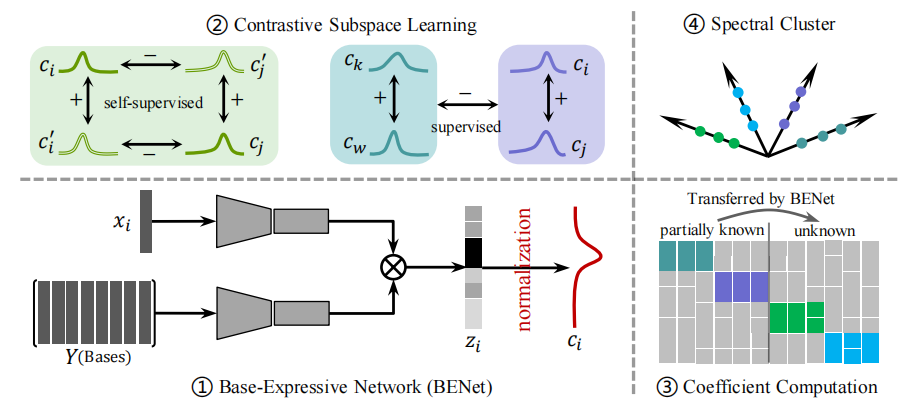

# Contrastive Subspace Distribution Learning for Novel Category Discovery in High-Dimensional Visual Data

This repository contians the Pytorch implementation of our paper [Contrastive Subspace Distribution Learning for Novel Category Discovery in High-Dimensional Visual Data](https://github.com/weishuai-GitHub/CSDL)



## Running

### Dependencies

```
pip install -r requirements.txt
```
### Run
```
sh train.sh
```

## Config
Configure the dataset path according to 
```config.py```

## Result

Our main results ```accelarate``` on generic image recognition datasets

|    Dataset    	|    All   	|    Old   	|    New   	|
| :-------------:	|:--------:	|:--------:	|:--------:	|
|    CIFAR10    	| 0.9666  	| 0.9696 	| 0.9696 	|
|  Fashion-Mnist   	| 0.8725 	| 0.9466	| 0.8355 	|
|     EMNIST	    | 0.7804	| 0.7933 	| 0.6865 	|
|    CIFAR100  	    | 0.7857 	| 0.7818	| 0.7929  	|

The unsupervised and semi-supervised results ```accelarate```

|    Dataset    | unsupervised|semi-supervised|    
|:-------------:| :----------:|:--------:|
|    CIFAR10    |    0.8768   | 0.9673 	 | 
| Fashion-Mnist |    0.6630   | 0.9155	 | 
|     EMNIST	|    0.7030	  | 0.9502 	 | 
|    CIFAR100  	|    0.5745   | 0.8289	 | 
## License

This project is licensed under the MIT License - see the [LICENSE](LICENSE) file for details.

## Citation
If you find this repository useful, please consider giving a citation

